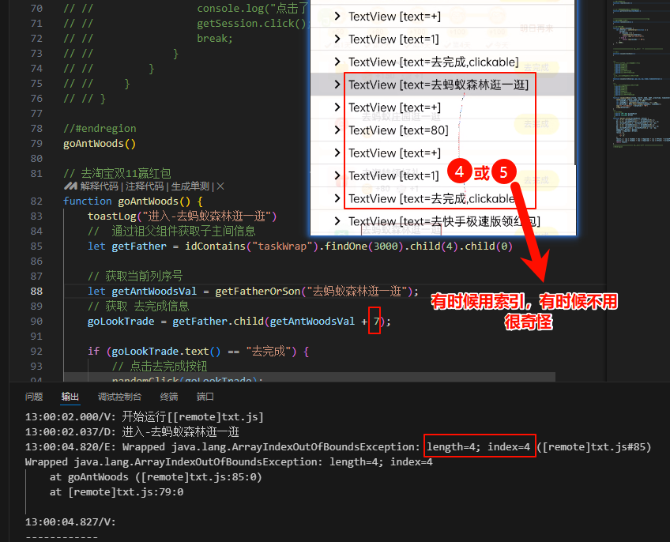

视频教学：https://www.bilibili.com/video/BV1Kf421Q7q9/?p=10&share_source=copy_web&vd_source=6117f6e013994472a5ec3c858ac511ea

文档：https://easydoc.net/doc/25791054/uw2FUUiw/TeRm1WHA#nav_3https://easydoc.net/doc/25791054/uw2FUUiw/TeRm1WHA#nav_3


Vs code安装两插件：

1. Auto.js-Autox.js-VSCodeExt
2. Auto.js-VSCodeExt-Fixed

```js

toastLog('你好，Auto.js')   // 控制台输出


// Auto.js代码提示插件
npm i @autojs/types-pro8 --no-bin-links   // v8项目- Auto.js代码提示插件
npm i @autojs/types-pro9 --no-bin-links   // v9项目- Auto.js代码提示插件
```


1.   `ipconfig  `命令 ping，是否ping的通
2.  关闭防火墙
3. 手机《连接电脑》的ip使用电脑的 **ip4**。
4. VsCode安装Auto.js-Autox.js-VSCodeExt插件，查看-》命令面板开启下面功能。


```js

log("log,你好，Auto.js");     // 控制台输出
toast("toast,你好，Auto.js");   //手机显示屏输出
toastLog('toastLog,你好，Auto.js')  // 控制台输出 和手机显示屏输出
alert("alert,你好，Auto.js"); //弹出对话框
```


```js

// Auto.js脚本全局变量与局部变量的定义是  字母/中文都可以. 
// Auto.js脚本函数名字母/中文都可以. 

//      例如：局部变量：    var 变量=3    var bl=3 
//      例如：全局变量：     变量=3;    bl=3;

function  函数体(){
    变量1=1,变量2=2  // 简写
}


函数体()
   var 变量3= 变量1+变量2;

log(变量3);
```


## 点击事件:

SimpleActionAutomator.setScreenMetrics(x,y);

```js

setScreenMetrics(1080,2400);  //解决屏幕宽度不一致软件坐标问题。 设置脚本坐标点击所适合的屏幕宽高。
//  1080,2400为真我Q2手机分辨率，
//怎么查看手机分辨率，手机截屏相片查看。
    click(931,2193);   //单击按钮,x要点击的坐标的x值,y要点击的坐标的y值 ,前提是这个控件的clickable属性为true
    // 注意：①前提把开发者模式的指针位置打开获取安卓上按钮的位置。
    // ②此命令只在当前分辨率有效，如需要在其他分辨率可以使用需要在前面加 setScreenMetrics(x,y)命令
longClick(x, y) //长按按钮,前提是这个控件的longClickable属性为true
press(x, y, duration) // x:要按住的坐标的x值,y:要按住的坐标的y值,duration:按住时长，单位毫秒,超过500毫秒，则认为是长按。注意：按住过程中被其他事件中断才会操作失败。

```


## 滚动条事件:

```js
swipe(405, 2040, 405, 405, 100) // 滚动条事件,  
         //  x1: 滚动的起始坐标的x值,y1:滚动起始坐标的y值,
        //  x2: 滚动的结束坐标的x值,y2:滚动的结束坐标的y值,
        // duration: 滚动时长，单位毫秒

swipeEx(405, 2040, 405, 405, 100) //滚动条事件, 非官方接口 ,不推荐使用有bug

gesture(duration, [x1, y1], [x2, y2], …)  //滚动条事件,数值-常用 duration手势的时长,[x, y] … 手势滑动路径的一系列坐标
```


## 控件操作:

```js
//  =====> 控件的常用属性：
//使用属性：  text() ==》desc() ==》id() ==》className() id软件升级后可能会变动。
className 类名。类名表示一个控件的类型，例如文本控件为"android.widget.TextView", 图片控件为"android.widget.ImageView"等。 //  *
packageName 包名。包名表示控件所在的应用包名，例如QQ界面的控件的包名为"com.tencent.mobileqq"。  
bounds 控件在屏幕上的范围。
drawingOrder 控件在父控件的绘制顺序。
indexInParent 控件在父控件的位置。
clickable 控件是否可点击。  
longClickable 控件是否可长按。
checkable 控件是否可勾选。
checked 控件是否可已勾选。
scrollable 控件是否可滑动。
selected 控件是否已选择。
editable 控件是否可编辑。
visibleToUser 控件是否可见，可以筛选在屏幕可视范围内的组件。  //  *
enabled 控件是否已启用。
depth 控件的布局深度。  //  *

```

## 增删查该：

```js
//使用属性：  text() ==》desc() ==》id() ==》className()==>id  注意：id软件升级后可能会变动。
// =======id
.id(resId)
.idContains(str) //     id 包含字符串 "str"的筛选条件
.idStartsWith(prefix) //  查询以“prefix 开头"的id
idEndsWith(suffix) //  查询以suffix 结束"的id
idMatches("[a-zA-Z]+")  // 根据正则表达式获取id 

// =======text/desc/className等跟id类似，把开头id的
text（'微信好友'）.waitFor（）// 等待执行
let collection = id("com.ss.android.ugc.aweme:id/container").find().size(); // 获取抖音视频
 let knownElement = id("puzzle-captcha-question-img").findOnce().next(); // 找到id("puzzle-captcha-question-img")的下一个兄弟元素
let knownElement = id("puzzle-captcha-question-img").findOnce().parent() // 返回该控件的父控件
childCount() // 返回子控件数目。
children() // 返回该控件的所有子控件组成的控件集合

   let text =  id("com.ss.android.ugc.aweme:id/desc").findOne() //  查询结果为{}的需要通过 toastLog(text.text())查询
 let a = id("com.ss.android.ugc.aweme:id/container").findOnce().child(0)   // 选中列表第一个
 letre=className（"android.widget.ImageView").descMatches（"评论.*?，按钮").findOne（5000);
var评论=descStartsWith（'评论'）.visibleToUser().findOne();
images.findImage(img, template[, options])

textEndsWith('关注').visibleToUser().findOne // 
textMatches("\\d+") // 正则表达式-Java-匹配多位数字
textMatches(/\d+/) //  正则表达式-Js-匹配多位数字
depth("15")
drawingOrder("14")


Auto.js的索引为0，AutoX.js索引为1。
```


## 软件打包：

   前提：①VsCode安装Auto.js-Autox.js-VSCodeExt插件。

​              ②手机需安装Auto和打包插件Alpha-release软件。

​      快捷键Ctrl+Shift+P(F1或 查看--》命令面板) ,保存到指定的设备。


## 验证码：

安卓脚本分类-点击滑动

1. root:adb,安卓调试桥，指针点击
2. 免root:无障碍服务，无指针点击

滑块处理流程-例如：腾讯QQ滑块处理（本地算法）

   1. 截图
   2. 裁剪
   3. 灰度化
   4. 二值化
   5. 遍历颜色
   6. 确定位置
   7. 滑动

```js
https://app.notdiamond.ai/
API Keys
   notdiamondAPI       sk-57960ce410511075a0529d6e6f448cfdbc504a7c52961431

```


# 优秀代码：

## 抖音自动刷视频：

[参考文档如下](https://zhuanlan.zhihu.com/p/430977461)

```js
auto.waitFor()

//打开抖音App
var appName = "抖音";
(appName);

//等待进入主界面成功
text("首页").waitFor();

toast("准备开始滑动")

//滑动（Root+坐标点）
while (true) {
    Swipe(200, 1000, 210, 400, 500);
    //休息5s钟
    sleep(5000);
    toast("继续滑动。。。")
}
```


## **淘宝点击领喵币按钮：**

前提：淘宝预先打开喵铺主页。

```js
auto.waitFor()
var appName = "手机淘宝";
launchApp(appName);
sleep(3000);
//寻找领喵币按钮并点击
var lingmiaobi = text("领喵币").findOnce();
if (lingmiaobi) {
    lingmiaobi.click();
    sleep(1000);
}
else {
    toast("未检查到领喵币按钮");
    //中止脚本
    exit();
}
```

**2.点击去进店/去浏览**

```js
//开始执行任务
execTask();
function execTask() {
    while(true) {
        var target =  text("去进店").findOnce() || text("去浏览").findOnce();
        if (target == null) {
            toast("任务完成");
            break;
        }
        target.click();
        sleep(3000);
        //浏览网页20s
        viewWeb(20);
        back();
        sleep(1000);
    }
}
```

**3.浏览广告**

```js
function viewWeb(time) {
    gesture(1000, [300, 600], [300, 300]);
    var cnt = 1;
    while(true) {
        var finish = desc("任务完成").exists() || textStartsWith("已获得").exists();
        if (finish || cnt > time) {
            break;
        }
        sleep(1000);
        cnt += 1;
    }
    //模拟返回键，返回到任务栏页面
    back();
}
```


## 软件强制更新：

```js
/**
 * 作者:  家
 * QQ:   203118908
 * 功能:  强制更新app
 */
'ui';
var dialog = new android.app.AlertDialog.Builder(activity).setTitle("Tips").setMessage("请更新最新版本!")
  .setNeutralButton("退出", new android.content.DialogInterface
    .OnClickListener({
      onClick: (dialog, which) => {
        exit()
      }
    })
  ).setNegativeButton("更新", new android.content.DialogInterface
    .OnClickListener({
      onClick: (dialog, which) => {
        toastLog('在这里更新app')
      }
    })
  ).show();
dialog.setCanceledOnTouchOutside(false); //点击dialog其它地方dismiss无效
dialog.setCancelable(false); //点击返回键无效
```

## 回到桌面：

```js

deskTop("com.miui.home:id/icon_title")
function deskTop(idSelector){
    for(1eti=0;i<10;i+)(
        //判断是否再桌面
        if(id().findonce()){
        break;
    }else{
        back();
        s1eep(1000);
        if(!id(idSelector).text("微信").visibleToUser().findonce(){
            home();
            s1eep(1000) 
        }
        toastLog('已回到桌面')；
    }
```

删除图片：

```js
clearDir("/storage/emulated/999/Pictures/weixin/");  // 微信双开图片存储位置-小米手机
clearDir("/storage/emulated/0/Pictures/weixin/");
function clearDir(dir) {
    var dirpath = dir;
    var arr = files.listDir(dirPath);
    arr.forEach(element => {
        var filepath = files.join(dirPath, element);
        log(files.remove(filePath));
        s1eep(100);
    });
    toast('图片清理成功')
}
```


## 获取屏幕所有消息：

```js
// 不再使用observeNotification，而是改用轮询或无障碍事件
// 示例：使用findWidget() + 定时检查来模拟监听QQ消息
// 遍历屏幕上的所有控件并打印它们的信息
// 获取当前屏幕的根控件
let root = idContains("PageMain").findOne();
logAllWidgets(root);

// 遍历屏幕上的所有控件并打印它们的信息
function logAllWidgets(widget) {
    console.log(222);
    if (widget) {
        console.log("ID: " + widget.id() + ", Text: " + widget.text() + ", Desc: " + widget.desc());
        let children = widget.children();
        for (let i = 0; i < children.size(); i++) {
            logAllWidgets(children.get(i));
        }
    }
}
console.log("234248888888888888888888");
```

## 修复无法获取剪贴板内容的问题

```js

// 开启前台服务
if (!auto.service) {
    toast("请先授予无障碍服务权限！");
    exit();
}

// 点击复制链接
let copyButton = text("icon_copy").findOne().parent().parent()
if (copyButton) {
    console.log(copyButton.click());

    sleep(1000)
    let fuzhi = className("android.widget.TextView").text("复制").findOne().click()
    console.log(fuzhi);

    log("已点击按钮");
}


// # region  获取剪贴板内容
threads.start(function () {
    // 创建一个悬浮窗
    let win = floaty.window(
        // 悬浮窗的布局为垂直方向排列
        <vertical>
        <input id="输入" w="*" h="50" />
        <button id="开始" text="开始" />
        </vertical>
    )
    // 设置窗口过滤器，这里的函数返回true表示接受所有窗口
    auto.setWindowFilter(function (window) {
        return true;
    });
    // 在UI线程中执行以下操作，确保窗口和输入框获取焦点
    ui.run(() => {
        console.log("win+输入" + win.requestFocus());

        win.requestFocus();
        win.输入.requestFocus();
    })
    // 启动另一个新线程来执行以下粘贴及后续操作
    threads.start(function () {
        et = className("EditText").findOne();
        et.paste();
        toastLog(win.输入.text())
        // 在UI线程中执行以下操作，禁用悬浮窗的焦点，使其不再获取用户输入焦点
        ui.run(() => {
            win.disableFocus();
        })
    })
})
// # endregion


```


2、私人助理RPA的原理

- 什么是私人助理RPA
- 使用场景：定时执行、指令执行
- 简单演示

开发步骤：

1. 把每天要做任务流程化
2. 把流程标准化
3. 开发私人助理RPA的框架
4. 增加功能扩展的方式
5. 实现7*24小时运行
6. 调试优化

3、私人助理RPA的框架开发
准备工作：两个微信，登录到不同或者相同的手机上
1、实现收到消息自动唤醒
2、程序结构分析（长时间运行、能够扩展、方便对接云控和群控）

- ·main.js(控制器角色)
- ·功能名，s(实现具体功能)
- ·common.js(公共函数)


## 抓包：

常见抓包软件：fillder 、黄鸟、postaman、charles 。。。

抓包软件的底层原理：

1. fillder   ==>  走的是 中间人iP代理192.168.XX.Xx
2. 黄鸟+postaman+charles    ==> vpn-建设一个虚拟机网络系统-降维打击

常见的防止抓包：
1.fillder httpde bug没配置对
2.fillder等抓不到包 、代理端抓包

抓包走的代理：
1. 证书校验。单向认证 JustMe
2. 双向认证：rsa算法  ，抓到包了。但是返回状态码：400 sl    ==》解决方法：使用JustMePlush软件


Hook专题

Xposed框架的核心是基于Java
Reflection机制，可以实现对Android
系统和应用中方法的拦截和修改。使用
Xposed框架的优点是，无需对应用程
序进行逆向工程或重新编译，只需编写
模块并安装即可实现功能扩展。
在Android平台上，Hook技术有多种实
现方法，如使用JavaReflection、动
态代理、NativeHook等。这些方法都
是基于对目标应用或系统方法的拦截，
然后插入或替换自定义的代码逻辑，以
序进行逆向工程或重新编译，只需编写
模块并安装即可实现功能扩展。

xposed框架是基于Hook技术的一个应
用，提供了更加方便的模块化开发方
式。这些技术使开发者能够轻松地为系
统和应用添加新功能或修改现有功能
同时提高应用的可定制性

# 抓包：

## 普通的代理抓包：

工具：charles fd
案例：网易新闻

## vpn转发方式抓包 ：                

操作：①wifi代理设置无。   ②使用postern或SocksDroid等VPN工具代理
工具： charles postern
案例：得物

## xposed定制模块抓包：

认证：

1.  单向认证：  企查查

2.    双向认证

     工具：lsp

   案例：抖音、快手、闲鱼、、大麦等

   解决方法，①使用xp模块， ②修改软件so文件配置


pro 连接VPN

```js
127.0.0.1localhost
::1 ip6-localhost
127.0.0.1 pro.autojs.org
127.0.0.1 data.flurry.com
127.0.0.1 c.sayhi.360.cn
127.0.0.1 android.bugly.qq.com
127.0.0.1 recaptcha.net
192.168.18.164 pro.autojs.org


链接地址中github.com前加入vscode.dev/或直接将github.com改为github.de
```


# 异常：

## ArrayIndexOutOfBoundsException：




## 组织：

```js

1、懒人精灵技术交流群：QQ群1：274094711 ，QQ群2：1134071169，QQ群3：177945188
2、Auto.js技术交流群：QQ群1：1137657563，QQ群2：1015039963，QQ群4：588796665，QQ群5：410253970
3、EasyClick技术交流群：QQ群1：773898117，QQ群2：565667995，QQ群3：933829783


```

