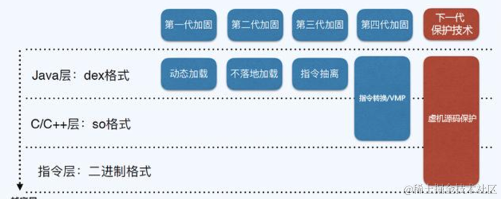
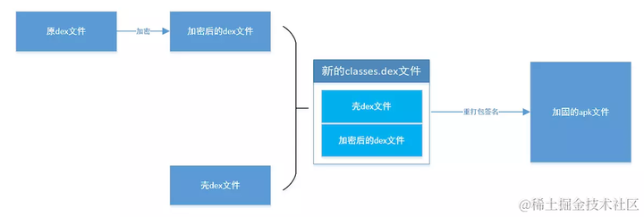

加固原理

### APP加固技术发展历程

### APK加固整体思路

加固整体思路：先解压apk文件，取出dex文件，对dex文件进行加密，然后组合壳中的dex文件（[Android](https://so.csdn.net/so/search?q=Android&spm=1001.2101.3001.7020)类加载机制），结合之前的apk资源（解压apk除dex以外的其他资源，如manifest、res等），打包新的apk文件，并对新的apk文件进行对齐、签名。

#### Android加固原理

Dex文件整体加固原理如下：

该过程涉及到三个对象，分别为

1.源程序 　　　　源程序也就是我们的要加固的对象，这里面主要修改的是原apk文件中的classes.dex文件和AndroidManifest.xml文件。 　　2.壳程序 　　　　壳程序主要用于解密经过加密了的dex文件，并加载解密后的原dex文件，并正常启动原程序。 　　3. 加密程序 　　　　加密程序主要是对原dex文件进行加密，加密算法可以是简单的异或操作、反转、rc4、des、rsa等加密算法。 　　　　该加固过程可以分为如下4个阶段： 　　　　　　（1） 加密阶段 　　　　　　（2）合成新的dex文件 　　　　　　（3）修改原apk文件并重打包签名 　　　　　　（4）运行壳程序加载原dex文件

#### 加密阶段

加密阶段主要是讲把原apk文件中提取出来的classes.dex文件通过加密程序进行加密。加密的时候如果使用des对称加密算法，则需要注意处理好密钥的问题。同样的，如果采用非对称加密，也同样存在公钥保存的问题。

#### 合成新的dex文件

这一阶段主要是讲上一步生成的加密的dex文件和我们的壳dex文件合并，将加密的dex文件追加在壳dex文件后面，并在文件末尾追加加密dex文件的大小数值

在壳程序里面，有个重要的类：ProxyApplication类，该类继承Application类，也是应用程序最先运行的类。所以，我们就是在这个类里面，在原程序运行之前，进行一些解密dex文件和加载原dex文件的操作。

#### 修改原apk文件并重打包签名

在这一阶段，我们首先将apk解压，会看到如下图的6个文件和目录。其中，我们需要修改的只有2个文件，分别是classes.dex和AndroidManifest.xml文件，其他文件和文件加都不需要改动。 　　首先，我们把解压后apk目录下原来的classes.dex文件替换成我们在上一步合成的新的classes.dex文件。然后，由于我们程序运行的时候，首先加载的其实是壳程序里的ProxyApplication类。所以，我们需要修改AndroidManifest.xml文件，指定application为ProxyApplication，这样才能正常找到识别ProxyApplication类并运行壳程序。

#### 运行壳程序加载原dex文件

Dalvik虚拟机会加载我们经过修改的新的classes.dex文件，并最先运行ProxyApplication类。在这个类里面，有2个关键的方法：attachBaseContext和onCreate方法。ProxyApplication显示运行attachBaseContext再运行onCreate方法。 　　在attachBaseContext方法里，主要做两个工作：

1.  读取classes.dex文件末尾记录加密dex文件大小的数值，则加密dex文件在新classes.dex文件中的位置为：len(新classes.dex文件) – len(加密dex文件大小)。然后将加密的dex文件读取出来，解密并保存到资源目录下
2.  然后使用自定义的DexClassLoader加载解密后的原dex文件

在onCreate方法中，主要做两个工作：

1.  通过反射修改ActivityThread类，并将Application指向原dex文件中的Application
2.  创建原Application对象，并调用原Application的onCreate方法启动原程序

