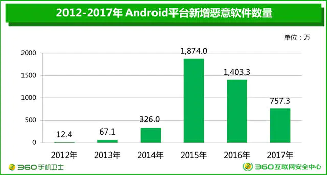
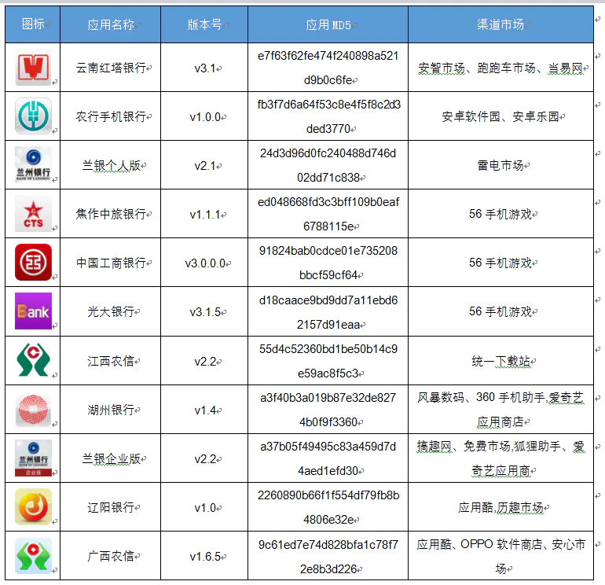
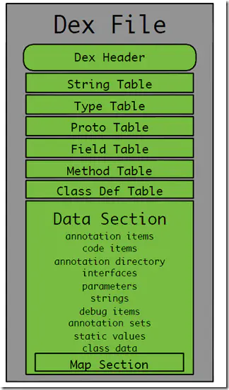

### 一、前言

Android开发者常常面临的一个问题就是防破解、 防二次打包。现如今安全问题越来越重要,越来越多的Android开发者也开始寻求安全的保护方案。请看一下下面的几张图片：

#### 1.1

#### 1.2

#### 1.3

### 二、什么是加壳？

移动平台攻防技术的发展基本是沿着PC端发展轨迹在进行,从windows平台的加壳脱壳反调试到Andriod的平台apk加固,反调试代码混淆等。

加壳是在二进制的程序中植入一段代码，在运行的时候优先取得程序的控制权，做一些额外的工作。大多数病毒就是基于此原理。PC EXE文件加壳的过程如下：

### 三、加壳作用和分类

作用：加壳的程序可以有效阻止对程序的反汇编分析，以达到它不可告人的目的。这种技术也常用来保护软件版权，防止被软件破解。

分类：从App的加固技术来看:主流分为dex加密和so加密,目前来看保护dex文件更为重要,应为dex反编译后的java代码可读性更强。

### 四、Android Dex文件加壳原理

#### 4.1.APK文件结构

每个文件及文件夹的作用如下表所示。

| 文件或目录 | 说明 |
| --- | --- |
| assets文件夹 | 存放资源文件的目录 |
| lib文件夹 | 存放ndk编译出来的so文件 |
| META-INF文件夹 | 1.该目录下存放的是签名信息，用来保证apk包的完整性和系统的安全性 2.CERT.RS 保存着该应用程序的证书和授权信息 3.CERT.SF 保存着SHA-1信息资源列表 4.MANIFEST.MF 清单信息 |
| res文件夹 | 存放资源文件的目录 |
| AndroidManifest.xml | 一个清单文件，它描述了应用的名字、版本、权限、注册的服务等信息。 |
| classes.dex | java源码编译经过编译后生成的dalvik字节码文件，主要在Dalvik虚拟机上运行的主要代码部分 |
| resources.arsc | 编译后的二进制资源文件。 |

#### 4.2DEX文件格式

4.2.1什么是DEX文件？

他是Android系统的可执行文件，包含应用程序的全部操作指令以及运行时数据

由于dalvik是一种针对嵌入式设备而特殊设计的java虚拟机，所以dex文件与标准的class文件在结构设计上有着本质的区别

当java程序编译成class后，还需要使用dx工具将所有的class文件整合到一个dex文件，目的是其中各个类能够共享数据，在一定程度上降低了冗余，同时也是文件结构更加经凑，实验表明，dex文件是传统jar文件大小的50%左右

4.2.2dex文件结构

Dex文件整体结构如下：

Dex文件整体结构说明：

| 数据名称 | 解释 |
| --- | --- |
| dex\_header | dex文件头部记录整个dex文件的相关属性 |
| string\_table | 字符串数据索引，记录了每个字符串在数据区的偏移量 |
| type\_table | 类似数据索引，记录了每个类型的字符串索引 |
| proto\_table | 原型数据索引，记录了方法声明的字符串，返回类型字符串，参数列表 |
| field\_table | 字段数据索引，记录了所属类，类型以及方法名 |
| method\_table | 类方法索引，记录方法所属类名，方法声明以及方法名等信息 |
| class\_def | 类定义数据索引，记录指定类各类信息，包括接口，超类，类数据偏移量 |
| data\_section | 数据区，保存了各个类的真是数据 |

下面是DEX文件目录：

dex文件.png

这里面，有3个成员我们需要特别关注，这在后面加固里会用到，它们分别是checksum、signature和fileSize。

checksum字段

checksum是校验码字段，占4bytes，主要用来检查从该字段（不包含checksum字段，也就是从12bytes开始算起）开始到文件末尾，这段数据是否完整，也就是完整性校验。它使用alder32算法校验。

signature字段： signature是SHA-1签名字段，占20bytes，作用跟checksum一样，也是做完整性校验。之所以有两个完整性校验字段，是由于先使用checksum字段校验可以先快速检查出错的dex文件，然后才使用第二个计算量更大的校验码进行计算检查。

fileSize字段

占4bytes，保存classes.dex文件总长度。

这3个字段当我们修改dex文件的时候，这3个字段的值是需要更新的，否则在加载到Dalvik虚拟机的时候会报错。

为什么说我们只需要关注这三个字段呢？

因为我们需要将一个文件(加密之后的源Apk)写入到Dex中，那么我们肯定需要修改文件校验码(checksum).因为他是检查文件是否有错误。那么signature也是一样，也是唯一识别文件的算法。还有就是需要修改dex文件的大小。

不过这里还需要一个操作，就是标注一下我们加密的Apk的大小，因为我们在脱壳的时候，需要知道Apk的大小，才能正确的得到Apk。那么这个值放到哪呢？这个值直接放到文件的末尾就可以了。

所以总结一下我们需要做：修改Dex的三个文件头，将源Apk的大小追加到壳dex的末尾就可以了。

我们修改之后得到新的Dex文件样式如下：  
\[图片上传失败...(image-831de6-1534489556791)\]

#### 4.3APK打包流程

上图中涉及到的工具及其作用如下：

| 名称 | 功能介绍 |
| --- | --- |
| aapt | 打包资源文件，包括res和assets文件夹下的资源、AndroidManifest.xml文件、Android基础类库 |
| aidl | 将.aidl接口文件转换成.java文件 |
| javaComiler | 编译java文件，生成.class字节码文件 |
| dex | 将所有的第三方libraries和.class文件转换成Dalvik虚拟机支持的.dex文件 |
| apkbuilder | 打包生成apk文件，但未签名 |
| jarsigner | 对未签名的apk文件进行签名 |
| zipalign | 对签名后的apk文件进行对其处理 |

#### 4.4加固原理

Dex文件整体加固原理如下：

在该过程中涉及到三个对象，分别如下：

l 源程序

源程序也就是我们的要加固的对象，这里面主要修改的是原apk文件中的classes.dex文件和AndroidManifest.xml文件。

l 壳程序

壳程序主要用于解密经过加密了的dex文件，并加载解密后的原dex文件，并正常启动原程序。

l 加密程序

加密程序主要是对原dex文件进行加密，加密算法可以是简单的异或操作、反转、rc4、des、rsa等加密算法。

该加固过程可以分为如下4个阶段：

（1） 加密阶段

（2）合成新的dex文件

（3）修改原apk文件并重打包签名

（4）运行壳程序加载原dex文件

4.4.1 加密阶段

加密阶段主要是讲把原apk文件中提取出来的classes.dex文件通过加密程序进行加密。加密的时候如果使用des对称加密算法，则需要注意处理好密钥的问题。同样的，如果采用非对称加密，也同样存在公钥保存的问题。

4.4.2 合成新的dex文件

这一阶段主要是讲上一步生成的加密的dex文件和我们的壳dex文件合并，将加密的dex文件追加在壳dex文件后面，并在文件末尾追加加密dex文件的大小数值

iamges

在壳程序里面，有个重要的类：ProxyApplication类，该类继承Application类，也是应用程序最先运行的类。所以，我们就是在这个类里面，在原程序运行之前，进行一些解密dex文件和加载原dex文件的操作。

4.4.3 修改原apk文件并重打包签名

在这一阶段，我们首先将apk解压，会看到如下图的6个文件和目录。其中，我们需要修改的只有2个文件，分别是classes.dex和AndroidManifest.xml文件，其他文件和文件加都不需要改动。

首先，我们把解压后apk目录下原来的classes.dex文件替换成我们在0x02上一步合成的新的classes.dex文件。然后，由于我们程序运行的时候，首先加载的其实是壳程序里的ProxyApplication类。所以，我们需要修改AndroidManifest.xml文件，指定application为ProxyApplication，这样才能正常找到识别ProxyApplication类并运行壳程序。

4.4.4运行壳程序加载原dex文件

Dalvik虚拟机会加载我们经过修改的新的classes.dex文件，并最先运行ProxyApplication类。在这个类里面，有2个关键的方法：attachBaseContext和onCreate方法。ProxyApplication显示运行attachBaseContext再运行onCreate方法。

在attachBaseContext方法里，主要做两个工作：

1.  读取classes.dex文件末尾记录加密dex文件大小的数值，则加密dex文件在新classes.dex文件中的位置为：len(新classes.dex文件) – len(加密dex文件大小)。然后将加密的dex文件读取出来，加密并保存到资源目录下
    
2.  然后使用自定义的DexClassLoader加载解密后的原dex文件
    

在onCreate方法中，主要做两个工作：

1.  通过反射修改ActivityThread类，并将Application指向原dex文件中的Application
    
2.  创建原Application对象，并调用原Application的onCreate方法启动原程序
    

### 五、加壳代码实现

#### 5.1、加壳程序项目：

WX20180808-010740.png

#### 5.2、核心代码

WX20180808-023340.png

### 六、常见加固平台

 省略。。。

### 七、App加固的利弊

正面:

1.保护自己核心代码算法,提高破解/盗版/二次打包的难度

2.缓解代码注入/动态调试/内存注入攻击

负面：

1.影响兼容性

2.影响程序运行效率.

3.部分流氓、病毒也会使用加壳技术来保护自己

4.部分应用市场会拒绝加壳后的应用上架

### 八、App安全未来展望

一款app的流水线,从开发到内测到平台到消费者再到破解者再到平台再到消费者，所以每一个环节都不可轻视！！！

### 九、App安全总结

| 风险名称 | 风险 | 解决方案 |
| --- | --- | --- |
| 1.App防止反编译 | 被反编译的暴露客户端逻辑，加密算法，密钥，等等 | 加固 |
| 2.java层代码源代码反编译风险 | 被反编译的暴露客户端逻辑，加密算法，密钥，等等 | 加固 ，混淆 |
| 3.so文件破解风险 | 导致核心代码泄漏。 | so文件加固 |
| 4.篡改和二次打包风险 | 修改文件资源等，二次打包的添加病毒，广告，或者窃取支付密码，拦截短信等 | 资源文件混淆和校验签名的hash值 |
| 5.资源文件泄露风险 | 获取图片，js文件等文件，通过植入病毒，钓鱼页面获取用户敏感信息 | 资源混淆，加固等等 |
| 6.应用签名未交验风险 | 反编译或者二次打包，添加病毒代码，恶意代码，上传盗版App | 对App进行签名证书校验 |
| 7.代码为混淆风险 | 业务逻辑暴露，加密算法，账号信息等等。 | 混淆（中文混淆） |
| 8.webview明文存储密码风险 | 用户使用webview默认存储密码到databases/webview.db root的手机可以产看webview数据库，获取用户敏感信息 | 关闭wenview存储密码功能 |
| 9.明文数字证书风险 | APK使用的数字证书用来校验服务器的合法性，保证数据的保密性和完成性 明文存储的证书被篡改造成数据被获取等 | 客户端校验服务器域名和数字证书等 |
| 10.调试日志函数调用风险 | 日志信息里面含有用户敏感信息等 | 关闭调试日志函数，删除打印的日志信息 |
| 11.AES/DES加密方法不安全使用风险 | 在使用AES/DES加密使用了ECB或者OFB工作模式，加密数据被选择明文攻击破解等 | 使用CBC和CFB工作模式等 |
| 12.RSA加密算法不安全风险 | 密数据被选择明文攻击破解和中间人攻击等导致用户敏感信息泄露 | 密码不要太短，使用正确的工作模式 |
| 13.密钥硬编码风险 | 用户使用加密算法的密钥设置成一个固定值导致密钥泄漏 | 动态生成加密密钥或者将密钥进程分段存储等 |
| 14.动态调试攻击风险 | 攻击者使用GDB，IDA调试追踪目标程序，获取用户敏感信息等 | 在so文件里面实现对调试进程的监听 |
| 15.应用数据任意备份风险 | AndroidMainfest中allowBackup=true 攻击者可以使用adb命令对APP应用数据进行备份造成用户数据泄露 | allowBackup=false |
| 16.全局可读写内部文件风险。 | 实现不同软件之间数据共享，设置内部文件全局可读写造成其他应用也可以读取或者修改文件等 | （1）.使用MODE\_PRIVATE模式创建内部存储文件（2）.加密存储敏感数据3.避免在文件中存储明文和敏感信息 |
| 17.SharedPrefs全局可读写内部文件风险。 | 被其他应用读取或者修改文件等 | 使用正确的权限 |
| 18.Internal Storage数据全局可读写风险 | 当设置MODE\_WORLD\_READBLE或者设置android:sharedUserId导致敏感信息被其他应用程序读取等 | 设置正确的模式等 |
| 19.getDir数据全局可读写风险 | 当设置MODE\_WORLD\_READBLE或者设置android:sharedUserId导致敏感信息被其他应用程序读取等 | 设置正确的模式等 |
| 20.java层动态调试风险 | AndroidManifest中调试的标记可以使用jdb进行调试，窃取用户敏感信息。 | android：debuggable=“false” |
| 21.内网测试信息残留风险 | 通过测试的Url，测试账号等对正式服务器进行攻击等 | 讲测试内网的日志清除，或者测试服务器和生产服务器不要使用同一个 |
| 22.随机数不安全使用风险 | 在使用SecureRandom类来生成随机数，其实并不是随机，导致使用的随机数和加密算法被破解。 | （1）不使用setSeed方法（2）使用/dev/urandom或者/dev/random来初始化伪随机数生成器 |
| 23.Http传输数据风险 | 未加密的数据被第三方获取，造成数据泄露 | 使用Hpps |
| 24.Htpps未校验服务器证书风险，Https未校验主机名风险，Https允许任意主机名风险 | 客户端没有对服务器进行身份完整性校验，造成中间人攻击 | （1）.在X509TrustManager中的checkServerTrusted方法对服务器进行校验（2）.判断证书是否过期（3）.使用HostnameVerifier类检查证书中的主机名与使用证书的主机名是否一致 |
| 25.webview绕过证书校验风险 | webview使用https协议加密的url没有校验服务器导致中间人攻击 | 校验服务器证书时候正确 |
| 26.界面劫持风险 | 用户输入密码的时候被一个假冒的页面遮挡获取用户信息等 | （1）.使用第三方专业防界面劫持SDK（2）.校验当前是否是自己的页面 |
| 27.输入监听风险 | 用户输入的信息被监听或者按键位置被监听造成用户信息泄露等 | 自定义键盘 |
| 28.截屏攻击风险 | 对APP运行中的界面进行截图或者录制来获取用户信息 | 添加属性getWindow().setFlags(FLAG\_SECURE)不让用户截图和录屏 |
| 29.动态注册Receiver风险 | 当动态注册Receiver默认生命周期是可以导出的可以被任意应用访问 | 使用带权限检验的registerReceiver API进行动态广播的注册 |
| 30.Content Provider数据泄露风险 | 权限设置不当导致用户信息 | 正确的使用权限 |
| 31.Service ，Activity，Broadcast,content provider组件导出风险 | Activity被第三方应用访问导致被任意应用恶意调用 | 自定义权限 |
| 32.PendingIntent错误使用Intent风险 | 使用PendingIntent的时候，如果使用了一个空Intent，会导致恶意用户劫持修改Intent的内容 | 禁止使用一个空Intent去构造PendingIntent |
| 33.Intent组件隐式调用风险 | 使用隐式Intent没有对接收端进行限制导致敏感信息被劫持 | 1.对接收端进行限制 2.建议使用显示调用方式发送Intent |
| 34.Intent Scheme URL攻击风险 | webview恶意调用App | 对Intent做安全限制 |
| 35.Fragment注入攻击风险 | 出的PreferenceActivity的子类中，没有加入isValidFragment方法，进行fragment名的合法性校验，攻击者可能会绕过限制，访问未授权的界面 | （1）.如果应用的Activity组件不必要导出，或者组件配置了intent filter标签，建议显示设置组件的“android:exported”属性为false（2）.重写isValidFragment方法，验证fragment来源的正确性 |
| 36.webview远程代码执行风险 | 风险：WebView.addJavascriptInterface方法注册可供JavaScript调用的Java对象，通过反射调用其他java类等 | 建议不使用addJavascriptInterface接口，对于Android API Level为17或者以上的Android系统，Google规定允许被调用的函数，必须在Java的远程方法上面声明一个@JavascriptInterface注解 |
| 37.zip文件解压目录遍历风险 | Java代码在解压ZIP文件时，会使用到ZipEntry类的getName()方法，如果ZIP文件中包含“../”的字符串，该方法返回值里面原样返回，如果没有过滤掉getName()返回值中的“../”字符串，继续解压缩操作，就会在其他目录中创建解压的文件 | （1）. 对重要的ZIP压缩包文件进行数字签名校验，校验通过才进行解压。 （2）. 检查Zip压缩包中使用ZipEntry.getName()获取的文件名中是否包含”../”或者”..”，检查”../”的时候不必进行URI Decode（以防通过URI编码”..%2F”来进行绕过），测试发现ZipEntry.getName()对于Zip包中有“..%2F”的文件路径不会进行处理。 |
| 38.Root设备运行风险 | 已经root的手机通过获取应用的敏感信息等 | 检测是否是root的手机禁止应用启动 |
| 39.模拟器运行风险 | 刷单，模拟虚拟位置等 | 禁止在虚拟器上运行 |
| 40.从sdcard加载Dex和so风险 | 未对Dex和So文件进行安全，完整性及校验，导致被替换，造成用户敏感信息泄露 | （1）.放在APP的私有目录 （2）.对文件进行完成性校验。 |