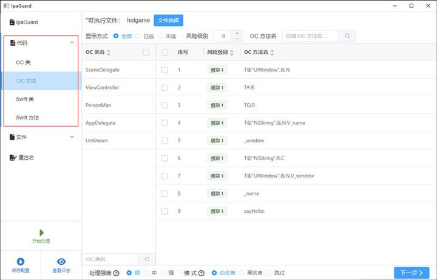
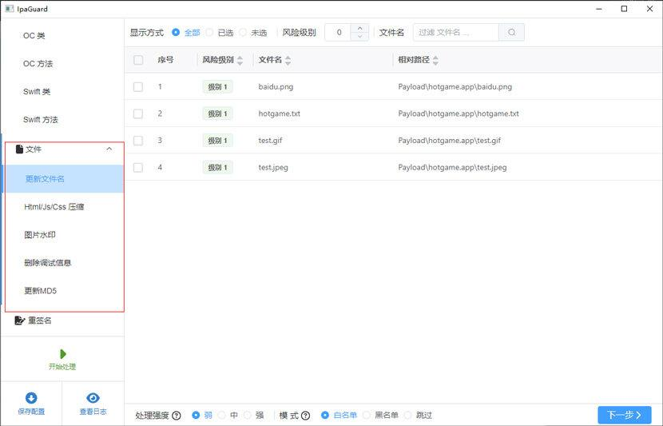
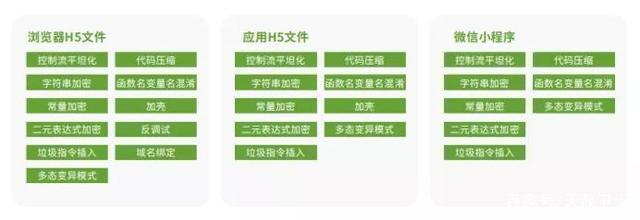

移动应用中存储着大量敏感数据，为了确保APP的安全性，除了定期进行安全检测外，还需要进行有效的安全加固工作，以防止二次打包、防止篡改、防止破解等各种安全威胁，并提前进行加密和加固工作，以保护开发者和用户的利益。

APP安全加固的对象包括Android应用加固、iOS应用加固、游戏应用加固、H5文件加固、微信小程序加固、SDK加固、so文件加固以及源代码混淆加固技术。这些措施可以帮助开发者有效地提升应用的安全性，保护用户和开发者的利益。

安全加固工作从根本上解决移动应用的安全缺陷和风险，使加固后的移动应用具备防逆向分析、防二次打包、防动态调试、防进程注入、防数据篡改等安全保护能力。

##  Android加固

Android应用安全加固，使用DEX VMP、DEX函数抽取加密及动态还原、DEX文件加壳、SO文件加固、H5文件混淆、SDK加固、资源文件完整性保护、防调试保护、签名校验、防截屏、防劫持等技术，使加固后的应用具备防逆向分析、防二次打包、防动态调试、防动态注入、防数据篡改等安全防护能力。

##  ios应用加固

iOS应用安全加固，使用常量字符串随机加密、等效指令替换、基本块分裂、基本块调度、虚假控制流、控制流扁平化、控制流间接化等技术，对IPA文件进行加固，或者在OC/C/C++/Swift代码编译的过程中对源码进行保护，增强加固后的应用的防逆向分析、防二次打包、防动态调试、防动态注入、防数据篡改等安全防护能力。

iOS加固我们可以使用工具[ipaguard](https://ipaguard.com/ "ipaguard")，目前还是免费阶段

下载ipa代码混淆保护工具

Ipa Guard是一款功能强大的ipa混淆工具，不需要ios app源码，直接对ipa文件进行混淆加密。不限制OC，Swift，Flutter，React Native，H5类app。工具跨平台版，windows,linux,mac系统都可用直接去官网下载[https://www.ipaguard.com](https://www.ipaguard.com/ "https://www.ipaguard.com")

获取ipagard登录码

双击ipaguard.exe启动ipaguard后点击右上角的登录按钮，输入邮箱后，没登录码的点击获取登录码，有的可以直接输入登录码

### 代码混淆

Ipa Guard可以对ipa文件中的类、方法、方法参数、变量等进行全面修改混淆，使其名称成为没有意义的乱码，极大地增加应用破解的难度。 选择要处理的ipa文件，点击左侧的代码菜单，里面可以分别对oc类，方法，swift类，方法等进行选择配置要处理的内容

### 文件混淆

Ipa Guard代码混淆工具支持对代码中的各种资源图片、js、mp3、xib、sb、json、html等名称进行修改，使其变得无意义，增加破解ipa的难度。

 

### IPA重签名与安装测试

ipaguard有签名和重签名功能，能在windows，mac，和linux上运行。在对ipa进行混淆和保护后，可以直接通过签名安装到测试手机，非常的方便测试检查混淆后的效果。

 

## SDK加固

SDK加固使用DEX加壳、DEX源码分离及动态还原、DEX VMP、防调试等技术对AAR、JAR文件进行加固，使加固后的 AAR、JAR文件具备防逆向分析、防动态调试等安全防护能力；对于SO文件，使用SO加固技术；对于iOS SDK，使用iOS源码混淆技术。

 

## SO加固

SO加固使用SO加壳、SO混淆、SO VMP、SO Linker、防调试、防调用、加固绑定等技术，使加固后的SO文件具备防逆向分析、防动态调试、防动态注入、防窃取等安全防护能力，降低SO文件被破解的风险。

## H5加固

H5安全加固使用源码混淆技术，对应用内调用的H5文件、通过浏览器访问的H5文件、微信公众号和微信小程序进行加固，同时支持一次一密，即同一个页面每次被访问时代码都不相同，提高了H5文件被破解的难度，增强了H5文件的安全性。

 

对APP进行安全加固，有利于：

(1) 保护应用不被静态分析和动态调试

(2) 保护应用内的敏感存储[数据安全](https://edu.csdn.net/cloud/pm_summit?utm_source=blogglc)

(3) 防止应用被进程注入

(4) 防止应用被二次打包

(5) 保护知识产权

(6) 保护开发者收益

(7) 保护品牌形象及信誉

